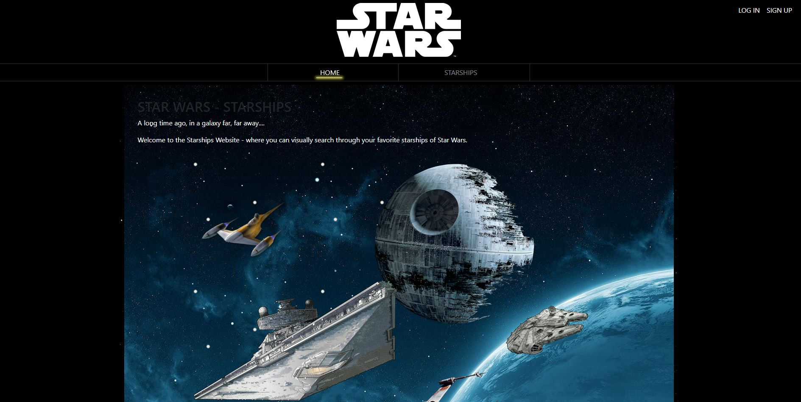

# Star Wars - Starships App

This project was generated with [Angular CLI](https://github.com/angular/angular-cli) version 13.3.7. The front-end framework also implements Bootstrap 5. This project is based off of a front end developer technical test of a large e-commerce sector company from Barcelona. The test involves consuming API data, displaying the data in a list, and cross referencing API calls with subsequent API calls within the Star Wars API.

This site requires a login or registration where the user's information is stored in local storage. Once a user is logged in, they are able to view a list of starships with corresponding pictures. Upon clicking on a ship's card, more information is presented and an additional API call is made which loads pilots associated with each ship.

As an advanced feature to help complete this challenge, infinite scrolling is implemented at the bottom of the screen when the user reaches the last starship, which then proceeds to load additional starships with an API call.

## **Preview**
## 

## :wrench: **Tech used in this project**
Front-End: Angular with [Bootstrap5](https://getbootstrap.com/) is used for the front-end UI Components. Within Angular, this projected implemented use of Angular Router with authorization guards, Http Client Module to make API calls, Observables to handle infinite scrolling and help wit http client calls, and Router animations to handle various page transtions.

## Development server

Run `ng serve` for a dev server. Navigate to `http://localhost:4200/`. The application will automatically reload if you change any of the source files.

## Code scaffolding

Run `ng generate component component-name` to generate a new component. You can also use `ng generate directive|pipe|service|class|guard|interface|enum|module`.

## Build

Run `ng build` to build the project. The build artifacts will be stored in the `dist/` directory.

## Running unit tests

Run `ng test` to execute the unit tests via [Karma](https://karma-runner.github.io).

## Running end-to-end tests

Run `ng e2e` to execute the end-to-end tests via a platform of your choice. To use this command, you need to first add a package that implements end-to-end testing capabilities.

## Further help

To get more help on the Angular CLI use `ng help` or go check out the [Angular CLI Overview and Command Reference](https://angular.io/cli) page.
